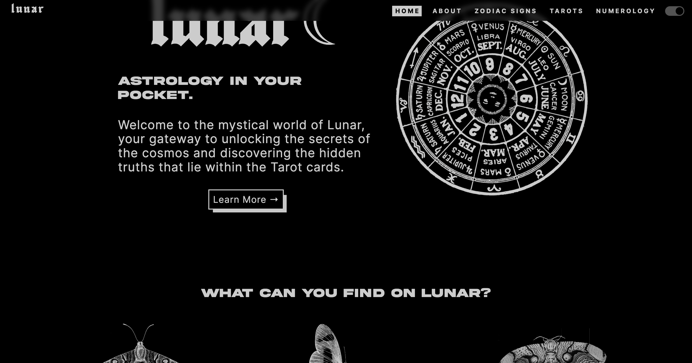
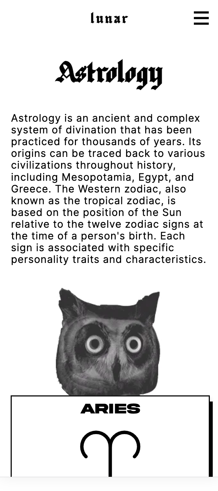
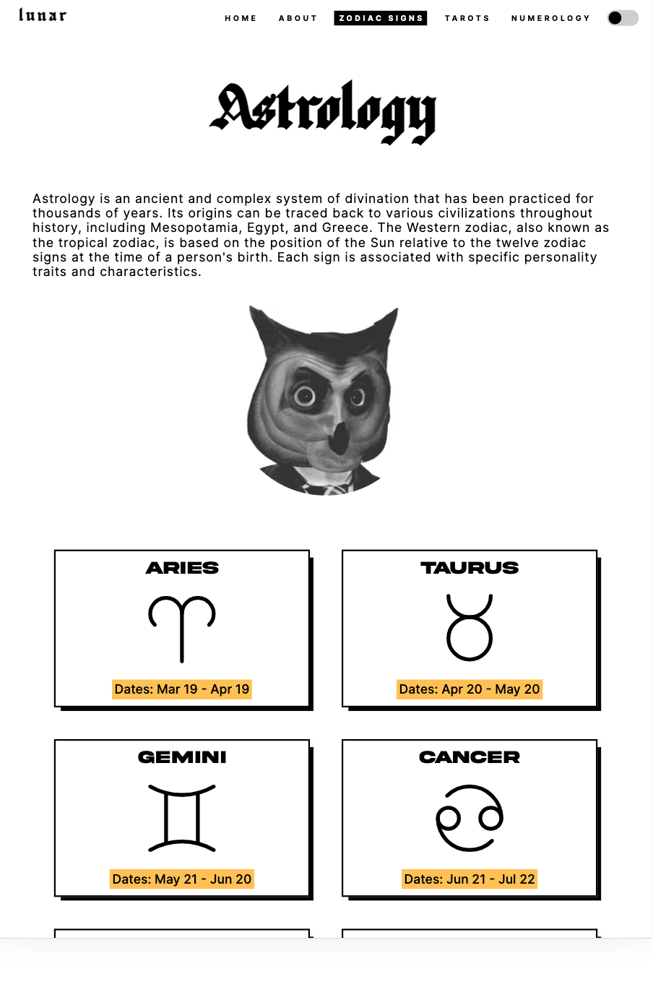
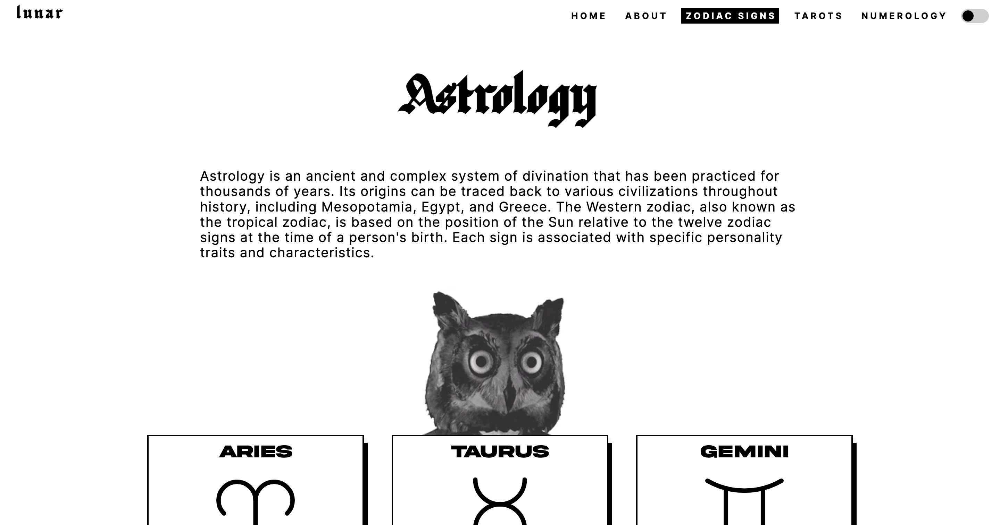

# LUNAR - Astrology, Tarot and Numerology App

[React.js](https://react.dev/) web app that fetches data from [Tarot API](https://jps-tarot-api.azurewebsites.net/swagger/index.html). Internal data is also employed to a limited extent.

Deployed version of [LUNAR](https://lunar-app.netlify.app/).

## Table of contents

- [Overview](#overview)
- [Built with](#built-with)
- [Features](#features)
- [Getting started](#getting-started)
- [Print Screens](#print-screens)
- [Conclusion](#conclusion)

## Overview

Lunar is a user-friendly app featuring a responsive design that seamlessly transitions between light and dark modes. It's perfect for individuals who want to explore astrology-related subjects but are new to the field. Lunar offers a comprehensive zodiac sign library, a tarot card collection, personalized tarot card readings, and a numerology calculator based on birth date and name.

## Built with

- React.js
- TypeScript
- CSS
- Swagger UI

## Features

- Data Fetching from Tarot API using Swagger UI allowing users to access a wide range of tarot-related information.
- Integration with the React.js framework for delivering a fast and smooth user experience.
- Intuitive and responsive user interface.
- Light/Dark Mode Switch enhancing the application's accessibility.
- Zodiac signs library with
- Flip tarot cards library including filtering and search bar.
- Individual tarot card readings, which can be regenerated onclick.
- A tool that calculates numerology insights based on user input, such as age and name, expanding the app's offerings.
- Utilization of internal data to perform numerical calculations.

## Getting started

If you want to run the project locally, you need to make sure you have [Node.js](https://nodejs.org/it) installed on your device. Then, simply clone the repository, install dependencies and start the development server using the line commands listed below.

```
git clone https://github.com/dxenia/astrology-app.git
cd astrology-app
npm install
npm run dev
```

## Print Screens

### Light/Dark Mode Comparison




### Responsive design

Mobile:<br />


Tablet:<br />


Laptop:<br />


## Conclusion

This application showcases the synergy of React.js and API integration, exemplifying the creation of a user-friendly and compelling digital experience. Its architecture allows for seamless scalability, making it a solid foundation for future enhancements and feature expansions.
